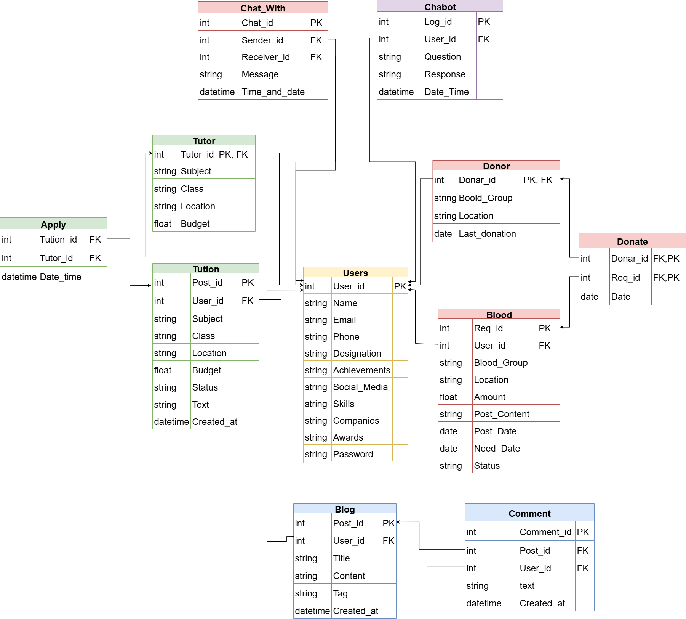
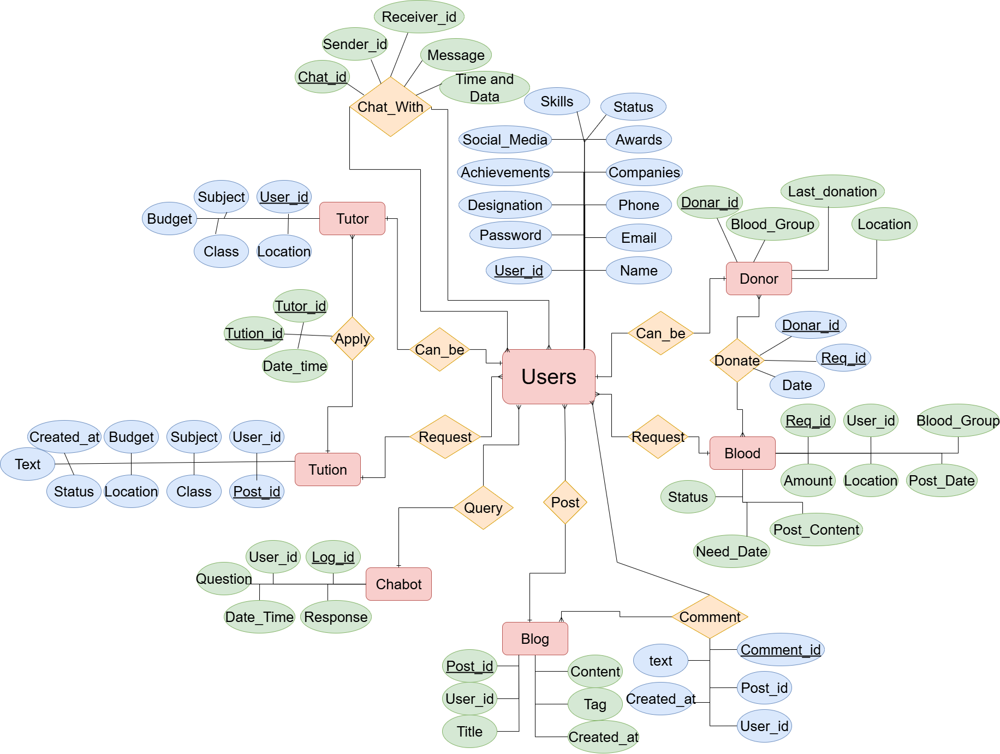

# CampusNet
CampusNet is a centralized platform designed to empower students by connecting them with alumni, tutors, blood donors, and institutional resources. With intelligent search, structured interfaces, and chatbot integration, StudentConnect ensures students have access to crucial academic and social support systems.
## 🗺️ Schema Diagram

## 🗺️ ER Diagram

